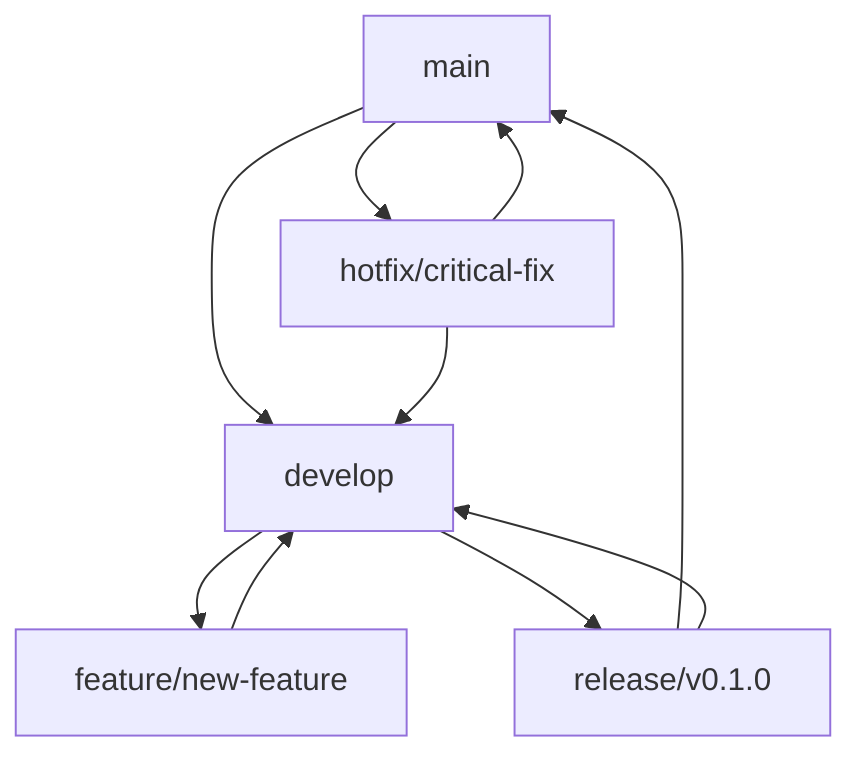

# Contributing to MindMapper

Thank you for your interest in contributing to MindMapper! This document provides guidelines and information for contributors.

## Table of Contents

- [Code of Conduct](#code-of-conduct)
- [Getting Started](#getting-started)
- [Branching Strategy](#branching-strategy)
- [Development Workflow](#development-workflow)
- [Pull Request Process](#pull-request-process)
- [Release Process](#release-process)
- [Coding Standards](#coding-standards)
- [Testing](#testing)
- [Documentation](#documentation)

## Code of Conduct

This project follows a code of conduct that we expect all contributors to adhere to:

- Be respectful and inclusive
- Welcome newcomers and help them learn
- Focus on constructive feedback
- Respect different viewpoints and experiences
- Show empathy towards other community members

## Getting Started

### Prerequisites

- Node.js (v16 or higher)
- npm or yarn
- Git
- Basic knowledge of Electron, React, and TypeScript

### Setup Development Environment

1. Fork the repository on GitHub
2. Clone your fork locally:
   ```bash
   git clone https://github.com/YOUR_USERNAME/mindmapper.git
   cd mindmapper
   ```

3. Install dependencies:
   ```bash
   npm install
   ```

4. Run the development server:
   ```bash
   npm run dev
   ```

5. Create a new branch for your feature:
   ```bash
   git checkout -b feature/your-feature-name
   ```

## Branching Strategy

We follow the **Git Flow** branching model with some adaptations for our release cycle:

### Main Branches

#### `main` Branch
- **Purpose**: Production-ready code
- **Protection**: Protected branch, requires PR reviews
- **Deployment**: Automatically deployed to production
- **Merging**: Only from `develop` or hotfix branches

#### `develop` Branch
- **Purpose**: Integration branch for features
- **Protection**: Protected branch, requires PR reviews
- **Merging**: From feature branches and hotfix branches

#### `Deploy-v0.1.x` Branch
- **Purpose**: Release branch for version 0.1.x series
- **Protection**: Protected branch, requires PR reviews
- **Merging**: From `develop` for release preparation

### Supporting Branches

#### Feature Branches (`feature/*`)
- **Naming**: `feature/description-of-feature`
- **Examples**: 
  - `feature/dark-mode-toggle`
  - `feature/export-png-support`
  - `feature/collaborative-editing`
- **Purpose**: New features or enhancements
- **Base**: `develop`
- **Merge**: Into `develop` via Pull Request

#### Bugfix Branches (`bugfix/*`)
- **Naming**: `bugfix/description-of-bug`
- **Examples**:
  - `bugfix/memory-leak-export`
  - `bugfix/linux-menu-crash`
- **Purpose**: Bug fixes for the current development version
- **Base**: `develop`
- **Merge**: Into `develop` via Pull Request

#### Hotfix Branches (`hotfix/*`)
- **Naming**: `hotfix/description-of-critical-issue`
- **Examples**:
  - `hotfix/security-vulnerability`
  - `hotfix/critical-crash-fix`
- **Purpose**: Critical fixes for production
- **Base**: `main` and `develop`
- **Merge**: Into both `main` and `develop`

#### Release Branches (`release/*`)
- **Naming**: `release/v0.1.0`
- **Purpose**: Prepare new production release
- **Base**: `develop`
- **Merge**: Into `main` and back to `develop`

### Branch Lifecycle



## Development Workflow

### 1. Feature Development

```bash
# Start from develop
git checkout develop
git pull origin develop

# Create feature branch
git checkout -b feature/your-feature-name

# Make your changes
# ... code changes ...

# Commit your changes
git add .
git commit -m "feat: add new feature description"

# Push to your fork
git push origin feature/your-feature-name
```

### 2. Bug Fix Development

```bash
# Start from develop
git checkout develop
git pull origin develop

# Create bugfix branch
git checkout -b bugfix/description-of-bug

# Make your changes
# ... code changes ...

# Commit your changes
git add .
git commit -m "fix: resolve bug description"

# Push to your fork
git push origin bugfix/description-of-bug
```

### 3. Hotfix Development

```bash
# Start from main
git checkout main
git pull origin main

# Create hotfix branch
git checkout -b hotfix/critical-issue

# Make your changes
# ... code changes ...

# Commit your changes
git add .
git commit -m "hotfix: resolve critical issue"

# Push to your fork
git push origin hotfix/critical-issue
```

## Pull Request Process

### Before Submitting

1. **Ensure your code works**:
   ```bash
   npm run build
   npm run package:linux  # or your platform
   ```

2. **Run tests** (when available):
   ```bash
   npm test
   ```

3. **Check code style**:
   ```bash
   npm run lint  # if available
   ```

4. **Update documentation** if needed

5. **Update CHANGELOG.md** in the `[Unreleased]` section

### Pull Request Guidelines

1. **Title**: Use conventional commit format
   - `feat: add new feature`
   - `fix: resolve bug`
   - `docs: update documentation`
   - `style: formatting changes`
   - `refactor: code restructuring`
   - `test: add tests`
   - `chore: maintenance tasks`

2. **Description**: Include:
   - What changes were made
   - Why the changes were necessary
   - How to test the changes
   - Screenshots/GIFs for UI changes
   - Related issues (use `Fixes #123` or `Closes #123`)

3. **Target Branch**: 
   - Features → `develop`
   - Bugfixes → `develop`
   - Hotfixes → `main`
   - Documentation → `develop`

4. **Review Process**:
   - At least one approval required
   - All CI checks must pass
   - No merge conflicts

### Pull Request Template

```markdown
## Description
Brief description of changes

## Type of Change
- [ ] Bug fix (non-breaking change which fixes an issue)
- [ ] New feature (non-breaking change which adds functionality)
- [ ] Breaking change (fix or feature that would cause existing functionality to not work as expected)
- [ ] Documentation update

## Testing
- [ ] Tested on Windows
- [ ] Tested on macOS
- [ ] Tested on Linux
- [ ] Added tests for new functionality

## Checklist
- [ ] My code follows the project's style guidelines
- [ ] I have performed a self-review of my code
- [ ] I have commented my code, particularly in hard-to-understand areas
- [ ] I have made corresponding changes to the documentation
- [ ] My changes generate no new warnings
- [ ] I have added tests that prove my fix is effective or that my feature works
- [ ] New and existing unit tests pass locally with my changes
```

## Release Process

### Version Numbering

We follow [Semantic Versioning](https://semver.org/):

- **MAJOR** (1.0.0): Incompatible API changes
- **MINOR** (0.1.0): Backwards-compatible functionality additions
- **PATCH** (0.1.1): Backwards-compatible bug fixes

### Release Workflow

1. **Prepare Release**:
   ```bash
   git checkout develop
   git pull origin develop
   git checkout -b release/v0.1.0
   ```

2. **Update Version**:
   - Update `package.json` version
   - Update `CHANGELOG.md` with release date
   - Commit changes

3. **Create Pull Request**:
   - PR from `release/v0.1.0` to `main`
   - Include release notes
   - Get approval

4. **Merge and Tag**:
   ```bash
   git checkout main
   git merge release/v0.1.0
   git tag -a v0.1.0 -m "Release version 0.1.0"
   git push origin main --tags
   ```

5. **Merge Back to Develop**:
   ```bash
   git checkout develop
   git merge release/v0.1.0
   git push origin develop
   ```

6. **Create GitHub Release**:
   - Go to GitHub Releases
   - Create new release from tag `v0.1.0`
   - Include changelog content
   - Attach build artifacts

## Coding Standards

### TypeScript/JavaScript

- Use TypeScript for all new code
- Follow ESLint configuration
- Use meaningful variable and function names
- Add JSDoc comments for public APIs
- Prefer `const` over `let`, avoid `var`

### React

- Use functional components with hooks
- Use TypeScript interfaces for props
- Keep components small and focused
- Use meaningful component names

### CSS

- Use CSS modules or styled-components
- Follow BEM methodology for class names
- Use CSS custom properties for theming
- Mobile-first responsive design

### File Organization

```
src/
├── main/           # Electron main process
├── preload/        # Electron preload scripts
└── renderer/       # React application
    ├── components/ # Reusable components
    ├── store/      # State management
    ├── utils/      # Utility functions
    ├── types/      # TypeScript definitions
    └── styles/     # CSS files
```

## Testing

### Testing Strategy

- **Unit Tests**: Test individual functions and components
- **Integration Tests**: Test component interactions
- **E2E Tests**: Test complete user workflows
- **Manual Testing**: Test on all supported platforms

### Running Tests

```bash
# Run all tests
npm test

# Run tests in watch mode
npm run test:watch

# Run tests with coverage
npm run test:coverage
```

## Documentation

### Documentation Standards

- Keep documentation up-to-date with code changes
- Use clear, concise language
- Include code examples where helpful
- Update README.md for major changes
- Document new APIs and features

### Required Documentation Updates

- **README.md**: For new features or major changes
- **CHANGELOG.md**: For all user-facing changes
- **ARCHITECTURE.md**: For architectural changes
- **USAGE.md**: For new user-facing features
- **API Documentation**: For new public APIs

## Getting Help

- **Issues**: Use GitHub Issues for bug reports and feature requests
- **Discussions**: Use GitHub Discussions for questions and ideas
- **Code Review**: Ask for help in pull request comments
- **Documentation**: Check existing docs first

## Recognition

Contributors will be recognized in:
- README.md contributors section
- Release notes
- GitHub contributors page

Thank you for contributing to MindMapper! 🧠✨
